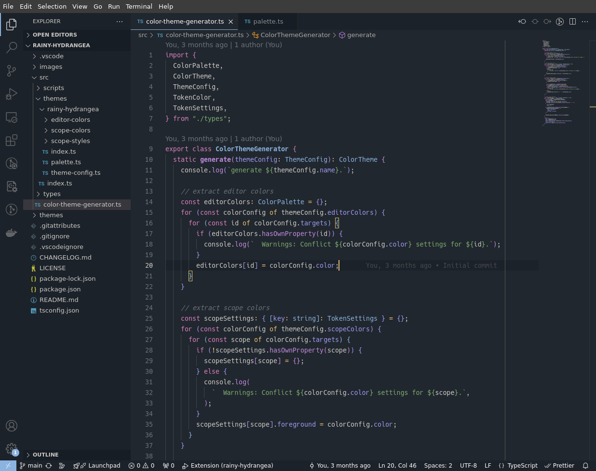

# Rainy Hydrangea

A dark theme for VSCode based on purple gradient colors.

## Screenshot

## Installation

1. Open **Extensions** sidebar on Visual Studio Code.
2. Search for `Rainy Hydrangea`
3. Click **Install**
4. Open **File > Preferences > Theme > Color Theme**
5. Choose **Rainy Hydrangea**

## Development

### Preparing Environment

1. Install [VOLTA](https://volta.sh/)
2. Run `npm install`

### Build and Apply Theme

1. Run `npm run build` in terminal.
2. Reload window.

## License

[MIT License](./LICENSE)
